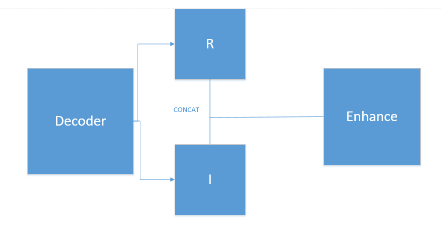

#  A summary of the week 

##  Research target

Low illumination image enhancement based on Retinex theory

## Main work

Retinex theory holds that any image can be divided into reflection and illumination components.

```
S = R* I
```


The reflection component is only related to the image content, and the illumination component is related to the illumination condition.So we  can improve the overall image quality by improving the light component.

Based on the above assumptions,we design the following model structure



In order to make the model more generalizable, we used unpaired datasets for training.One of the problems with using unpaired datasets is the lack of monitoring information throughout the training process.So we introduce perceptual loss and adversarial loss.

