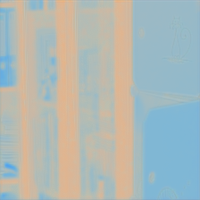
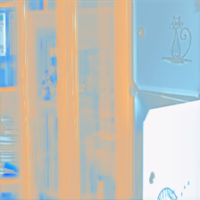

When I try to train the model to decompose the image into the reflection component and illumination component, the model can complete the task well. Due to the lack of supervision information, the model decomposes the image arbitrarily, which does not meet the expectations. We want the reflection component to be constant. Since the data in the dataset is not matched, we try to introduce self-monitoring information. As we all know Gamma transformation can change the brightness of the image. If we input the gamma transform image, the output reflection component should be the same.

low light img R

normal img R

It looks much better, but it can't be called a standard light image. So we need to further mine the information in asymmetric data to further improve our model.