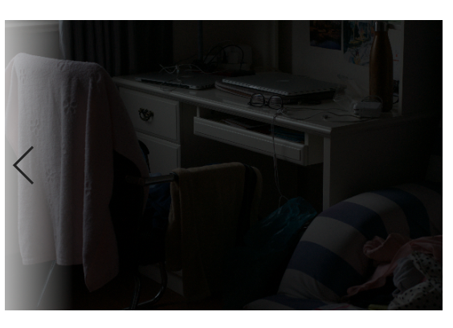
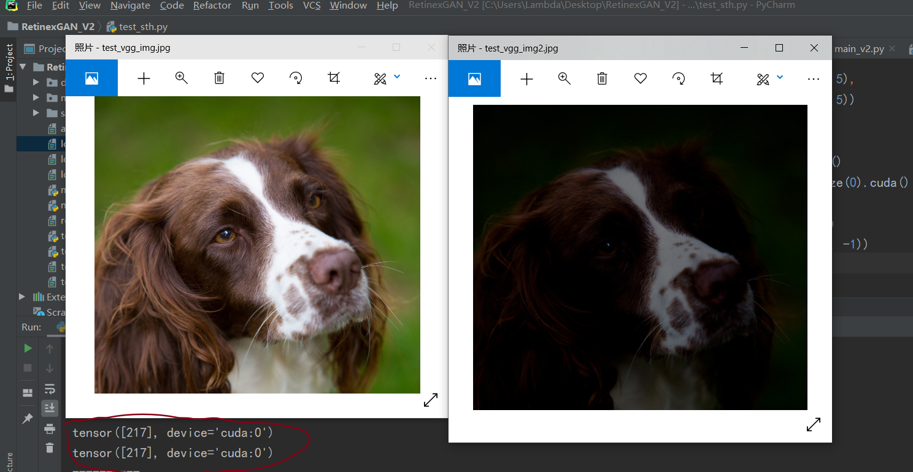

Although I added anti-loss in the model, the effect was very poor.

The model adopts PatchGAN discriminator structure, but it is found in the training process that the combat loss converges quickly at the high level and "Gradient disappeared" occurs. So I tried to use WGAN-GP to optimize the training process, but the output remained the same. I guess the reasons might be as follows:

EnlightenGAN in the study found that the brightness change will not affect VGG network classification results.

So there is no clear information in my model that guides the discriminator  what is bright and what is dark.

I think I can introduce label information like CGAN to guide the discriminator but now I don't know how to do that.