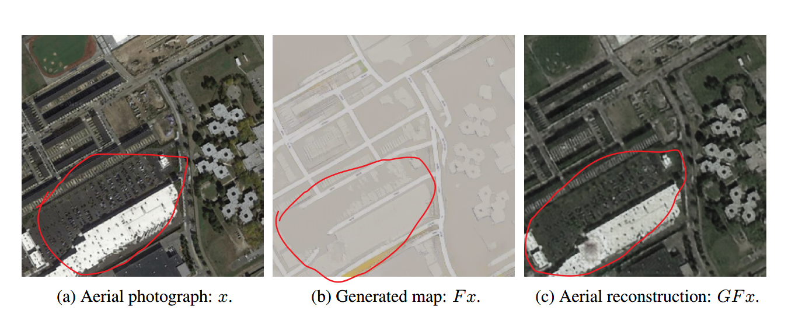
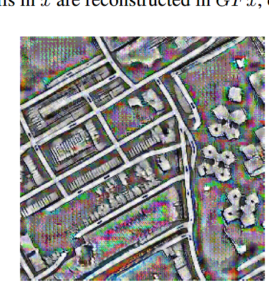

Fun cycleGAN

Do you believe that machines can cheat? CycleGAN proposed a new approach to image translation. The loss of consistency proposed by cycleGAN allows the algorithm to be imaginative. But recently the researchers found that in order to complete the image translate task, CycleGAN was trained in a form of steganography that humans can't detect, tricked its creators into leaving a secret cheat sheet, and then successfully completed the task. The researchers made an interesting discovery, as shown in the figure below.

From the above we can see that there are some textures in both the original image and the reconstructed image, but these textures are missing in the generated image. So how does the machine restore those textures from the generated image? The CNN must have used some undetectable means to hide this information in the generated images. The researchers enhanced the original and generated images, and the results are shown below.

As shown, there is some invisible noise in the areas of those textures. So we can be sure that the network hides information through these high frequency, low amplitude noises. The researchers also found that cycleGAN is vulnerable because it cheats during training.