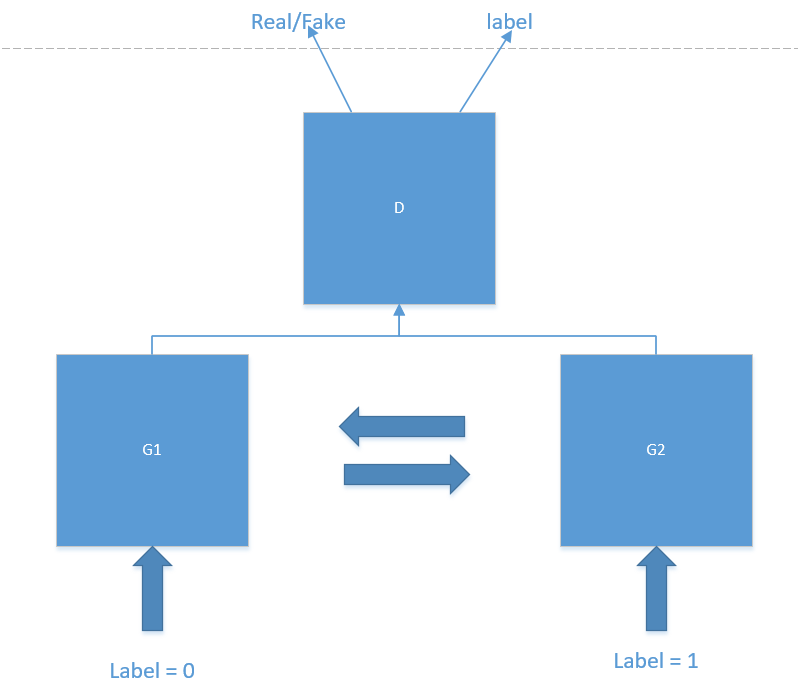

A method for intrducing label information into CycleGAN

Research shows that the introduction of label information in GAN can better control certain attributes of the generated image. In our previous experiments, we found that the network cannot obtain brightness-related features, and thus cannot enhance the image brightness. Therefore, we hope that this problem can be solved by introducing label information. But how to add label information in cycleGAN?

As we all know,the task of cycleGAN is to complete the conversion between the two domains. So we can treat two different fields as two different labels. Further we can simplify the structure of cycleGAN and combine the two discriminators into one. The specific structure is shown below.

