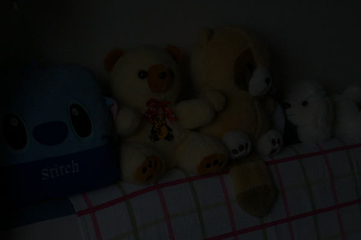

When I want to use synthetic images to guide model training, some new problem is born. First of all there is color deviation between gamma transformed image and real image. Then the synthetic image is noisy. I use L1 norm as the reconstruction loss to train my network, and the final result is as shown in the figure.

It can be seen from the figure that the brightness has improved obviously, but there is a lot of noise. Using L2 or L1 as the reconstruction loss, the network will output an average image

Most of the time, we can't express the loss function with explicit mathematical expression, so we can use neural network to approximate it. This technology is GAN. Therefore, a discriminator is added to the network to use asymmetric real images to guide the network to generate more real images. Therefore, the network structure is shown in the figure below.

