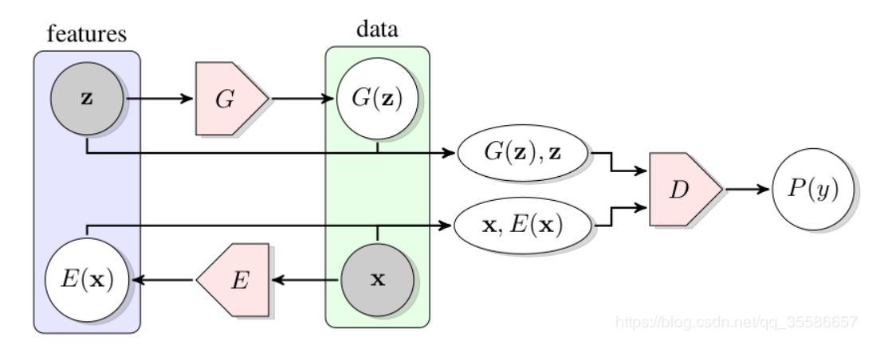
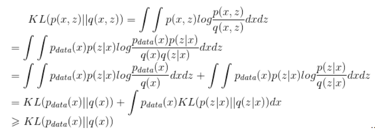

## Understand BiGAN

Both VAE and GAN are common generative models. For the VAE structure: image1 is input to the encoder to generate the output vector, and this vector is input to the decoder to generate image2, and then minimize the reconstruction error. The optimization goal of GAN is the output of discriminator D, and the input is the real picture and the false picture generated by random sampling noise through G.

BiGAN puts forward a new optimization idea combining codec structure and discriminator structure:

1. Input image x (x is the real picture in the data set), get E (x) through the encoder E
2. Random noise z is sampled from a distribution (such as Gaussian distribution, uniform distribution, etc.), and G (z) is obtained through the decoder G
3. Through the above two steps, we can get a series of (x, E (x)) and (G (z), z), the former is generated by Encoder, the latter is generated by Generator, these results are input into Discriminator, let It judges whether it is E or G; if D cannot judge accurately, then it succeeds

So what is the purpose of BiGAN?

## Some thing of Variational inference

The generative model generally fits the real data distribution P_data by minimizing the KL divergence of the edge probability

The essence of variational inference is to change the KL divergence of the edge distribution to the KL divergence of the joint distribution.

In BiGAN, if the discriminator cannot discriminate, it means that the KL divergence of the two joint distributions reaches the minimum. Then the KL divergence of the edge distribution also reaches the minimum, that is, the goal of image generation is achieved.

