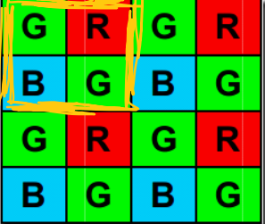

Recently, there has been a question in the ISP challenge. When dealing with raw images, why is it possible to turn a single channel into a four channel. For a RAW image, isn't every pixel a spatial record of the image?

Wouldn't it be equivalent to messing up the spatial information if we changed the raw image from a single channel to a four channel image?

Rethink the process of turning a single channel into a four channel.

We spread four pixels in a 2 by 2 region over four channels, which is very similar to the traditional method of interlaced sampling. Regardless of channel transformation, an interlaced sampling is done for each channel. On the other hand, bayer array is used to complete the color information by the pixels around the pixel, such a channel transformation exactly preserves the color information.

