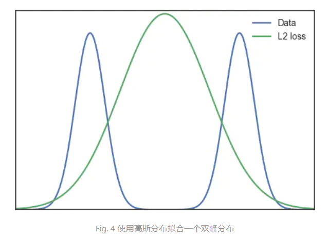

Why does L2 loss function cause image blur?

I have also recorded relevant problems before, but I did not give a particularly good explanation at that time. Now I would like to reorganize this problem. If we search for the word "Apple" in Google Images, we get a lot of results. This includes all kinds of Apples, and you'll most likely find Apple(company) on your search. Further, we can assume that there are many peaks in the true distribution of all apple-related images, such as apple being a peak, Apple being a peak, and so on. This image distribution is called multimodal. So there's a problem. If we use it as a loss function, the underlying assumption is that the samples we collect are all in the same Gaussian distribution. But in real life, most manifolds of image distribution have more than one peak due to their various features. If we force a Gaussian distribution with a single peak to fit a multi-modal data distribution, the following results will appear.

More specifically, if the two patterns are "red apples" and "green apples," then the images we generate probably don't fall into either category. Further, if we combine all Car properties in a higher-dimensional image space, we might get more different modes. The resulting image is the result of all of these possible mode averages. So our picture is going to be blurred.