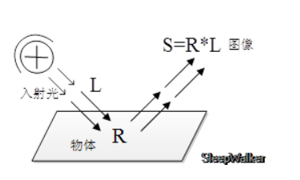

# Introduction to Retinex

Retinex is the color theory proposed by Land in the 1970s. I think the core idea is based on two things

1. In color perception, human eyes are more sensitive to local relative light intensity than absolute light intensity
2. The reflection component R(x,y) stores the real appearance of objects with or without light source, and the more accurate an image's estimation of its illumination component L(x,y), the more accurate the R(x,y) is obtained

To explain the first point, people's cognition of color is not based on the absolute light intensity. In the image reaction, it can be understood as that human's cognition of the color of a pixel (X0,Y0) is not based on the absolute value of its RGB three-channel, but related to two factors

1. Point (X0,Y0), the difference in the value of the three channels, it will cause color deviation
2. (X0,Y0) The RGB value of the remaining pixels in a neighborhood, which will form the sense of color, and the absolute value of the RGB three-channel dominates the sense of brightness

If there is no light source in a given scene, then R(x,y) should be constant. No matter how the light L(x,y) changes, R(x,y) should not change. That is, no matter what color or intensity of my light, I should be able to correct it for standard light conditions. This is also the embodiment of color constancy

