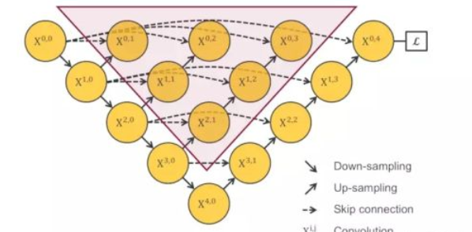
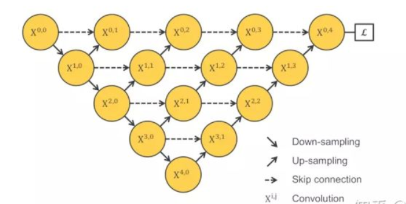
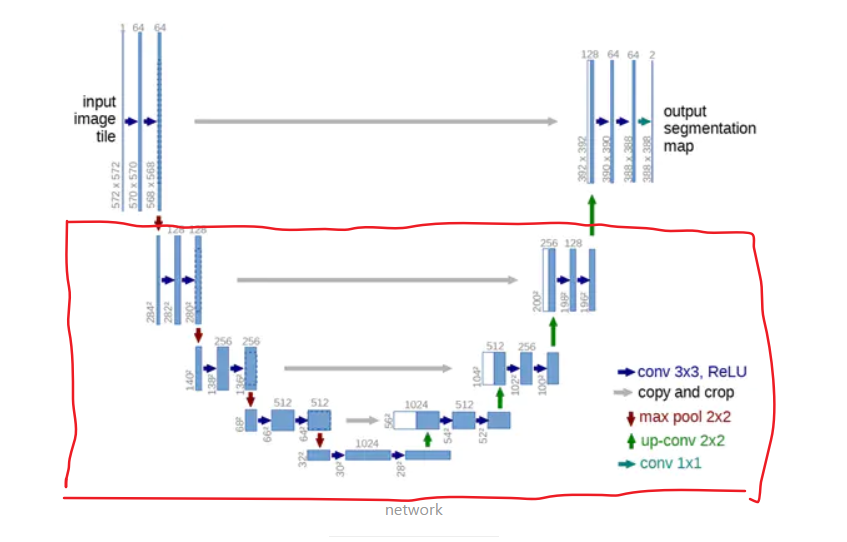
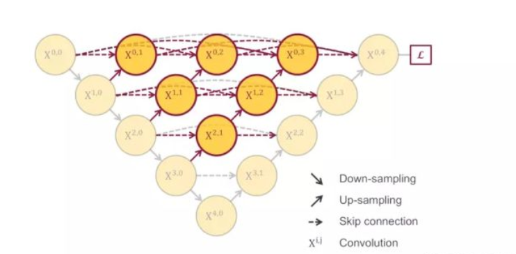

Last time, by analyzing the number of layers of UNET, we improved UNET and got the structure as shown in the figure.

However, this structure has an obvious disadvantage, that is, the red part of the diagram will not acquire the gradient and therefore will not be trained. The intuitive idea is that we can connect all the nodes.

But is such a structure better than Unet? Let me think about the structure of Unet from the beginning.

If we think of the red local area as a layer, then the structure is very similar to ResNet, and UNET is exactly the effect of ResNet through this long connection, which may also be the reason for UNET's strength. So, long connections are important. Our above-mentioned structure ignores this point, so we can continue to improve it.

未完待续。。。