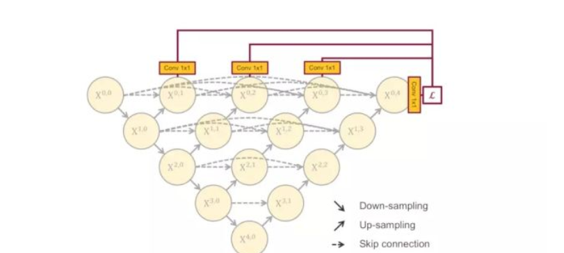

This time, let's take a closer look at the UNET + +, which fills the original hollow u-net. This structure can capture the features of different levels and integrate them by the way of feature concatenation. If you look at the feature superposition process of one layer horizontally, it is like a DeneNet structure. It is very coincident that the original u-net looks like a residual structure. The reason for the improvement of u-net segmentation effect by UNET + + is the same as that of DenseNet for ResNET.

Further, if we add the deep supervision method to UNET + +, as shown in the figure below

This brings the possibility of network pruning.

In the test phase, because the input image only propagates forward, throwing away this part has no effect on the previous output. In the training stage, because there are both forward and backward propagation, the cut part will help other parts to update the weight

In the process of deep monitoring, the output of each sub network is actually the result of the task, so if the output of the small sub network is good enough, we can cut off those redundant parts at will