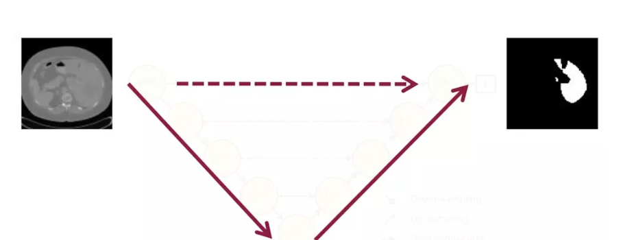
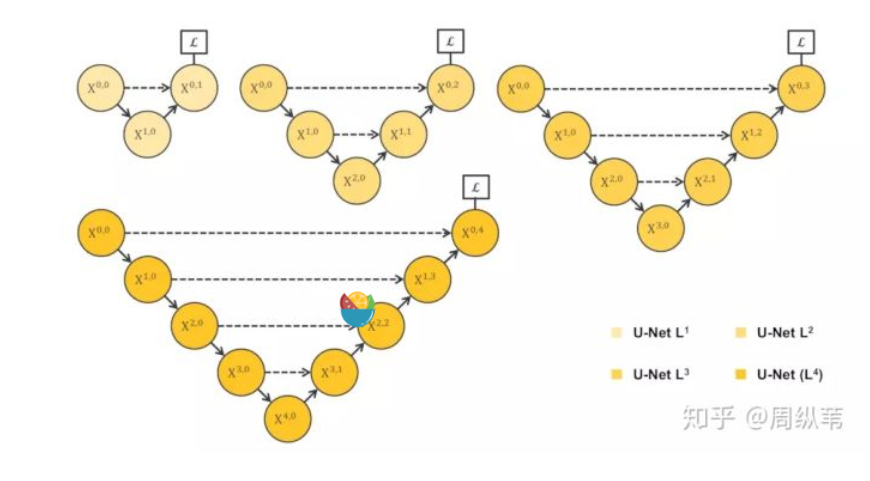
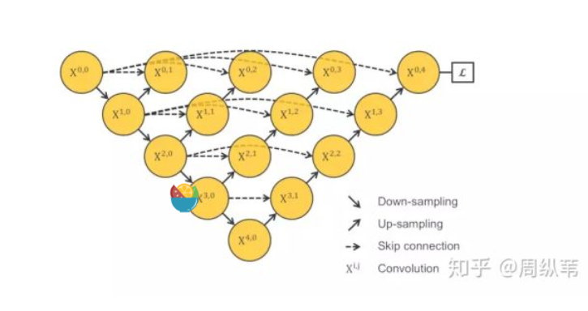

Learn U-Net (1)

In the field of computer vision, FCN is a well-known image segmentation network and the direction of medical image processing. U-net can be said to be a more popular network.

U-net and FCN are very similar. U-net was put forward a little later than FCN, but both were published in 2015. Compared with FCN, the first feature of U-NET is complete symmetry, that is, the left and right sides are very similar. The second difference is SKIP Connection. Summation is used by FCN while concatenation is used by U-NET. These are all details, but the point is that they're structured in a classic way, which is encoding and decoding.

The input is a graph and the output is the segmentation result of the target. To simplify further is to take a graph, encode it, or sample it down, decode it, sample it up, and output a split. Based on the difference between the result and the real segmentation, the back propagation is used to train the segmentation network.

In the past three years, U-NET has received more than 2,500 citations and FCN nearly 6,000 citations, but is there really nothing wrong with this structure?

First of all, the first question is why UNET USES four layers of downsampling. How deep should UNET be designed?

For the feature extraction stage, shallow structure can capture the image of some simple features, such as the border, color, and deep structure because receptive field, and with more convolution operation and can grab the abstract nature of the image of some indescribable chemistry, more and more the metaphysics, in short, shallow shallow focus, deep has the advantage of deep. Since both shallow features and deep features are important, why does U-NET only return after 4 levels, that is, it only captures deep features.

Mimicking the idea of solving the width of a network as in Inception Net, we can also let the network learn how deep it should be. So you have a structure like this.

 

未完待续。。。。