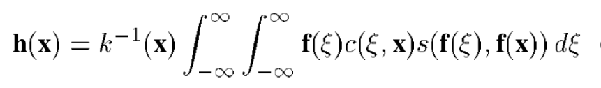

# Bilateral filtering

The most original denoising method is mean filtering (or Gaussian filtering). For a pixel X in the image, a square neighborhood with a certain size is set, and the (weighted) average value of the gray value of other pixels in the neighborhood is used to update the pixel of this point. Generally, the closer to x, the greater the weight. This method of weight generation based on distance ignores the similarity between pixels. For example, the pixel value of a certain distance from the center point is much larger than that of the center point. Although the distance weight is small, it has a greater impact on the central pixel due to its larger pixel value. In a word, generalization of bilateral filtering is that: the weighting coefficient of neighborhood filtering not only considers geometric distance, but also considers gray similarity.

Intuitively speaking, in a white area, there is a black dot noise, so the normal points in the neighborhood because of its gray difference is almost the same, and then the distribution of similarity weights is basically the same. In this way, the filtering is similar to Gaussian mean filtering. For the edge detail part, our own requirement is to make the weight assigned to the side with large gray value difference (i.e. outside the boundary) be smaller, while the weight allocated within the boundary is significant, which is exactly what the similarity function s can provide.