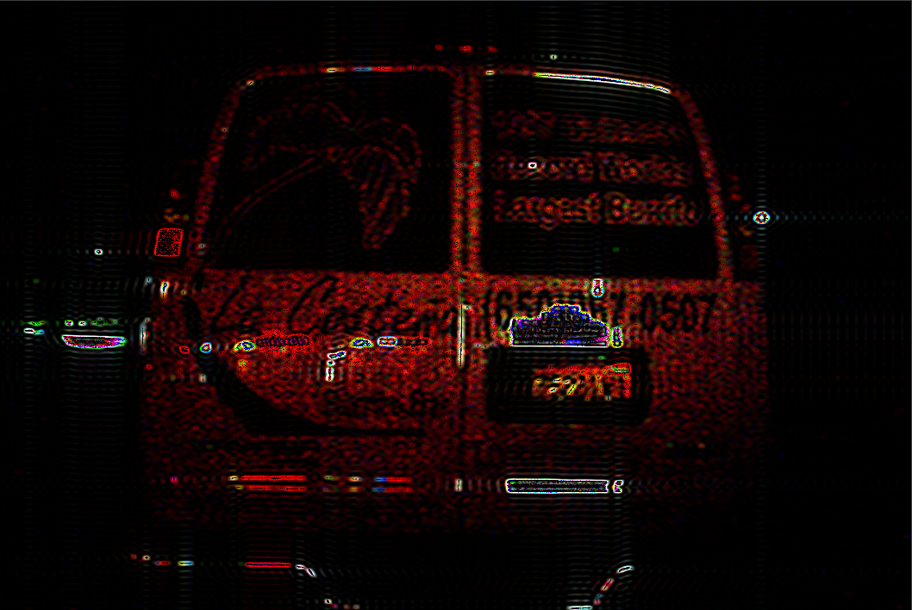

# Test

Homomorphic filtering 

It can be seen from the experimental results that suppressing the low frequency component can enhance the brightness and restore the original information, but the design of high pass filter is a difficult problem.

The philosophy of neural network tells us: neural network is a universal fitting device. Can we learn a high pass filter by training?