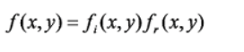
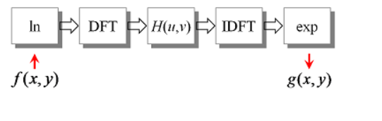

 # Homomorphic filter 

Homomorphic system: it is to transform nonlinear problems into linear problems. In other words, the nonlinear (multiplicative) hybrid signal is transformed into additive model by some mathematical operation (such as logarithmic transformation), and then processed by linear filtering method.

Homomorphic filtering: it is a kind of image processing method combining frequency filtering and spatial gray-scale transformation. According to the illuminance / reflectivity model of the image as the basis of frequency domain processing, it improves the image quality by compressing the brightness range and enhancing the contrast.

An image can be regarded as composed of two parts.

Retinex ????

Among them, fi represents the illumination component with different spatial position, which is characterized by slow change and concentrated in the low frequency part of the image. Fr represents the reflection component of the scene reflected to the human eye. Its characteristics include all kinds of information of scenery and rich in high frequency components

Homomorphic filtering is to suppress the low-frequency brightness component and enhance the high-frequency reflection component through a high-pass filter, so as to achieve brightness adjustment and contrast enhancement

Q:

The illumination information is mainly concentrated in the low frequency. If I use the low frequency component as a constraint loss when training the low illumination network, will it enhance the brightness?

